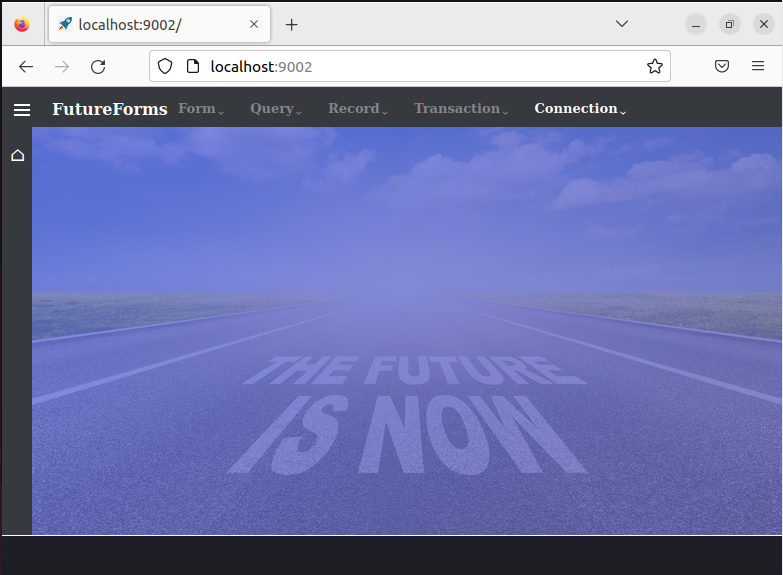
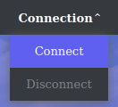
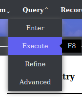
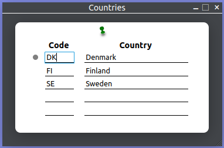

# FutureForms featured demo installation

This Ansible script will install FutureForms with the extended demo.
This demo will show what a lot of the classes in FutureForms can do.

## Requirements

Read the requirements at the [frontpage](../../README.md).

## Clone repository

Create a working directory with name of choice and go into it.
Then clone this repository.

```
mkdir foo
cd foo
git clone https://github.com/peter-gram/ff-install ff-install
cd ff-install
```

## Configure

In the top of [install-demo.yml](install-demo.yml) tho
following changes might be required.

The default target host is set to `app` which could be set to localhost
if you are running on the same server.

The `install_path` is set to `~/futureforms` in your home dir.
This is where the installation will be located.

## Install

Run the `install-demo.yml` playbook:

```
ansible-playbook playbooks/demo/install-demo.yml 
```

The installation, download and compilation takes about 3 minutes
and will take up about 1.1GB disk space.

## Start database.js

`database.js` is a Java program which is the actual web server.
Go to the directory and start the webserver:

```
cd ~/futureforms/database.js.demo/
bin/database.js start
```

Now the web service is running on port 9002
and can be seen at http://localhost:9002/

Now the frontscreen can be seen.



Click `Connection` in the menu bar and then `Connect`.



Enter demo user `hr`and demo password `hr` to login to the database.


Click the *hamburger button* ☰ in upper left corner and then `Countries`


The empty Countries table is now shown.


Click `Query` and `Execute` in the top menu or press the key `F8`.



Now the table is filled with data from the database.


